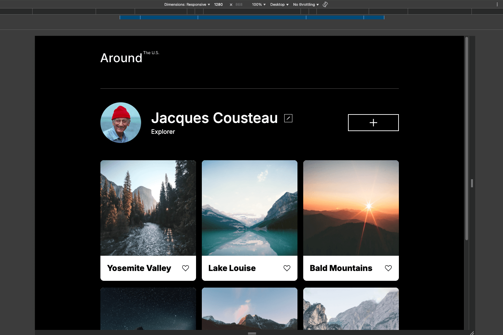
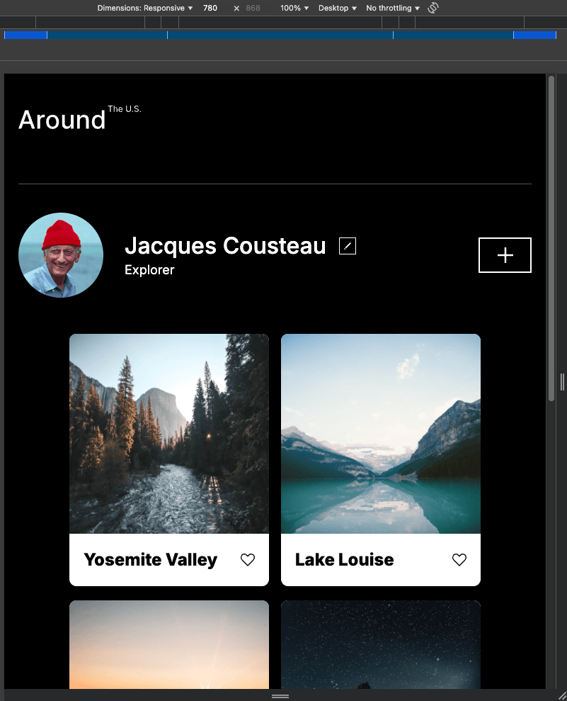
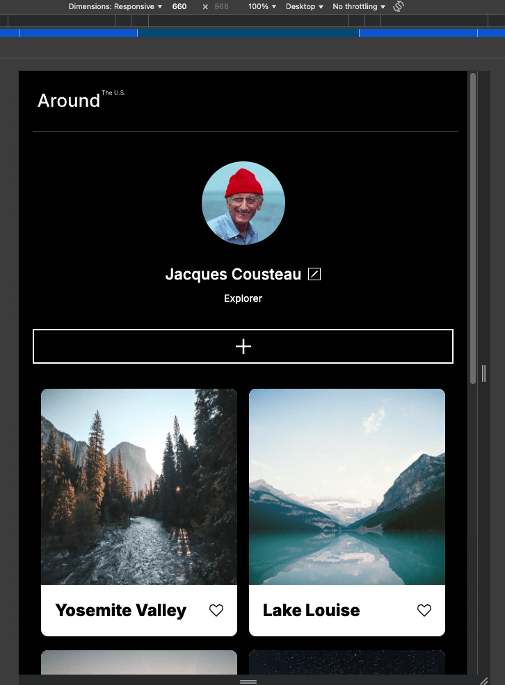
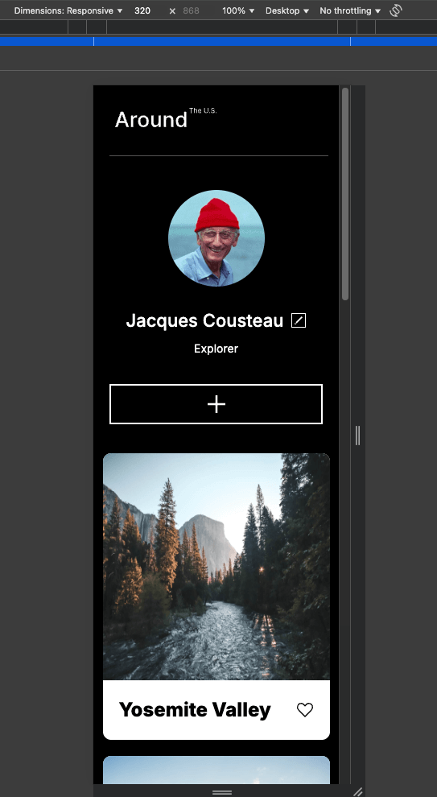

# Project 3: Around The U.S.

A responsive webpage featuring a travel photo gallery; showcasing iconic natural landmarks and scenic landscapes across the the Unitied States.

## Overview

Built with HTML and CSS. Site features a profile section and photo cards allowing users to personalize their webpage.

Features:

- Profile section with avatar, name, description, and cards as photo gallery. Allowing users to personalize their webpage and share their desired photos.
- Made with Grid Layout for cards with responsive breakpoints to accommodate various screen widths. Optimized for for desktop, tablet or mobile viewing; 1280px+, 780px, and 320px respectively. The layout adjusts elements throughout the page for a smooth transition between screen widths.

Technology:

- HTML
- CSS: flexbox, grid layout
- Responsive Design: Media queries
- Figma
- VS Code

Screen display set 1280px and compatible in larger sizes.

First media query set 780px to avoid edit and add button from colliding. Font sizes in user name and description were reduced slightly to improve a smoother transition as screen sizes shrink.

Next media query set at 660px. As screen size shrink, buttons collided and name does not display due to lack of horizontal space. Cards drop from three columns down to two columns. As the page continues to transition to mobile view, 320px; fonts, headers, profile, and footer styles for mobile view are loaded.

Preview of 320px, mobile view.

## Getting Started

To view and run the project:

### Prerequisites

- Modern web browser (Chrome, Safari, FireFox)
- Code Editor (VS Code)
- Figma: [Link to the project on Figma](https://www.figma.com/file/ii4xxsJ0ghevUOcssTlHZv/Sprint-3%3A-Around-the-US?node-id=0%3A1)
- [Video Recap of Project 3](https://drive.google.com/file/d/1b7LMyvmBdxXJ9ykburuNeACj_1uXK42c/view?usp=sharing)

### Steps

1. Clone repository:
   - HTTPS:
     https://github.com/westcode808/se_project_aroundtheus.git
   - SSH: git@github.com:westcode808/se_project_aroundtheus.git
2. Open project via browser or live server extension in code editor

## Further Enhancements

- Build a sign-in and sign-up page to allow users to access their accounts from any device.
- Add functionality to edit and add buttons. Currently, buttons aren't usable.
